<p><a name=top> </a>&nbsp;</p>
<p align=center>
    <a
    href="/README.md#top"></a> <a
    href="/docs/syllabus.md#top"></a> <a
    href="https://docs.google.com/spreadsheets/d/1Jlx-BBsvVqmWhW1L9Fz6u18vPSjGXj1i/edit?usp=sharing&ouid=110996670184359055145&rtpof=true&sd=true"></a> <a
    href="https://moodle-courses2425.wolfware.ncsu.edu/course/view.php?id=7150"></a> <a
    href="https://discord.gg/whDXzJGP"></a> <a
    href="https://ncsu.hosted.panopto.com/Panopto/Pages/Sessions/List.aspx?folderID=958aa5e8-f99e-441f-a545-b26400dfe515"></a> <a
    href="/LICENSE.md"></a>
    <br>&nbsp;<br>
    
</p>
<h1 align="center">:cyclone:&nbsp;CSC510: Software Engineering<br>NC&nbsp;State, Spring&nbsp;'25</h1>
      


# Testing


## Glossary


- Testing Concepts
  - Testing
  - Regression Testing
  - Unit Testing
  - Systems Testing
  - Integration Testing
  - Acceptance Testing
    - User Acceptance Testing
    - Contractual and Regulatory Acceptance Testing
  - Alpha Testing
  - Beta Testing
  - V-Diagram
    - Verification
    - Validation
  - Fault vs Failure
    - Fault
    - Failure


- Requirements
  - Functional Requirements
  - Non-Functional Requirements
  - Stakeholders
  - Multi-Stakeholder Systems


- Software Quality Attributes ("-ilities")
  - Maintainability
  - Customizability
  - Scalability
  - Capacity
  - Availability
  - Reliability
  - Recoverability
  - Serviceability
  - Security
  - Regulatory
  - Manageability
  - Environmental
  - Data Integrity
  - Usability
  - Interoperability


- Test Strategies
  - Test-Driven Development (TDD)
    - Red-Green-Refactor
  - Test Case Prioritization
    - Elbaum Heuristic
  - Black-Box Testing
    - Functional Testing
    - Metamorphic Testing
      - Metamorphic Relations (MRs)
    - Diversity Sampling
      - All-Pairs Testing
    - Fault Localization
      - Spectrum-Based Fault Localization
    - Doodling
    - Fuzzing
      - Grammar-Based Fuzzing
      - Mutation-Based Fuzzing
      - Coverage-Guided Fuzzing
      - Example Mining for Grammar Weights


- White-Box Testing
  - Statement Coverage
  - Function Coverage
  - Branch Coverage
  - du Coverage (Definition-Use)
  - Symbolic Execution
    - Abstract Syntax Tree (AST)
    - Constraint Solving


- Formal Methods
  - Temporal Logic
    - Always ([]), Eventually (<>), Until (U)
  - Truth-Functional Propositional Logic
  - Theorem Provers
  - CNF (Conjunctive Normal Form)
  - Pycosat
  - DIMACS Format


- Product Lines and Feature Models
  - Feature Model
  - Product Line
  - Formal Modeling of Software Installations
  - Opium
  - Minimal Install
  - Optimization via Theorem Negation


## Quotes


- f u cn rd ths, u cn gt a gd jb n sftwr tstng.<br>
  - Anonymous
- "Program testing can be a very effective way to show the presence of bugs, but is hopelessly inadequate for showing their absence."<br>
  -  Edsger Dijkstra
- If debugging is the process of removing bugs, then programming must be the process of putting them in.<br>
  - Edsger Dijkstra
- Beware of bugs in the above code; I have only proved it correct, not tried it.<br>
  - Donald Knuth
- ... it is a fundamental principle of testing that you must know in advance the answer
   each test case is supposed to produce. If you don't, you are not testing; you are experimenting."<br>
  - Kernighan and Plauger
- Debugging is like a mystery novel where you are both the
  detective and the murderer.
  - Anon


## Why test?


- Check some code
- Re-check some code (regression testing; has anything new broken  anything old)?
- Good manners for your team mates
  - Do not commit things that will hurt them
- Because there is so much to test for
  - Functional requirements: what the system does
  - Non-functional requirements: how the to judge the operation of a system (more general that the functional requirements)
- Conformance to the requirements
  - But whose' requirements?
    - Welcome to the wonder of multi-stakeholder systems
    - Even if we try to make it complete,complete for who
      - Stakeholders, [competing goals](https://arxiv.org/pdf/1702.05568)
      - Toronto CS department. Information system
        - "good" if parents can track their children
        - "good" if students  can maintain their privacy


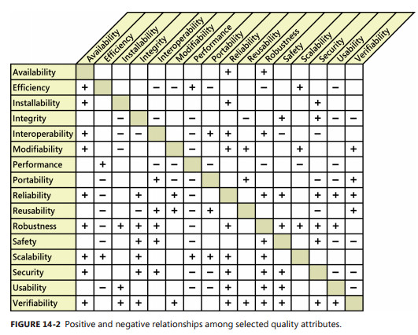


- Examples non-functional
  - For "maintainability?"
    - how to test that, except to watch the code for years to come?
  - Performance:
    - Energy usage
    - Network request response time?
    - Minimize variance in query spike time
  - Documentation :
    - Incomplete, always
  - For "usability"?
    - For other "ilities" (Maintainability, Customizanility,
    Scalability, Capacity, Availability, Reliability, Recoverability, Maintainability, Serviceability, Security, Regulatory, Manageability, Environmental, Data Integrity, Usability,
    Interoperability
  - And the list goes one and on and on


## V-Diagram


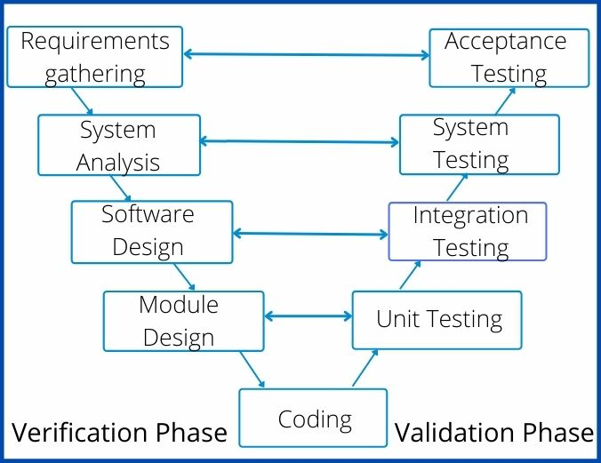


- verification = are we building the system right?
- validation = are we building the right system?
- "Without requirements or design, programming is the art of adding bugs to an empty text file."
  -- Louis Srygley
- Brooks, [Mythical Man Month](https://web.eecs.umich.edu/~weimerw/2018-481/readings/mythical-man-month.pdf).
  Effort is
  - 1/3 th planning
  - 1/6 th coding
  - 1/4 th unit testing : testing your own code
  - 1/4 th systems testing : testing your code, combined with others
    - may include:
      - Integration testing: verify the interfaces between components against a software design.
      - Acceptance testing:
        - User acceptance testing
        - Contractual and regulatory acceptance testing 
      - Alpha and beta testing
        - Alpha testing is simulated or actual operational testing by potential users/customer
        - Following alpha testing: external testing with a larger audience
           - Released to a limited audience outside of the programming team
- see also [other breakdowns](https://scholar.google.com/scholar?hl=en&as_sdt=0%2C47&q=An+Assessment+of+Rules+of+Thumb+for+Software+Phase+Management%2C+and+the+Relationship+Between+Phase+Effort+and+Schedule+Success&btnG=), with different numbers
  - but the less is the same: more time in testing that coding.


## Fault vs Failure


**Fault:** as an incorrect step, process, or data definition in a program.


- different to **failure** (when something actually goes wrongs)
- a program may have many faults, but never fail


Reliability engineers  propose shipping software once the expected
number of pre-release faults fall below a certain threshold. This
ap proach assumes the causal model:


pre-release faults →post-release failures


Using data from real-world projects, Fenton & Neil report many
examples of few pre-release faults but many post-release failures.


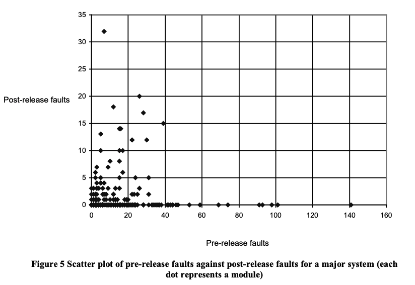


To reconcile this anomaly, they expand the above simple causal model
to incorpo-rate factors like system usage, defect detection, and
design e!ort.


This revised model (shown at right) shows how (e.g.) systems with
no testing could exhibit few faults but many failures.


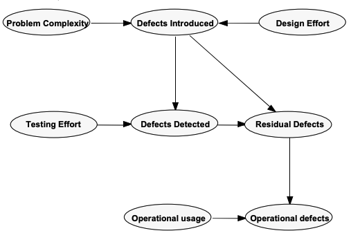


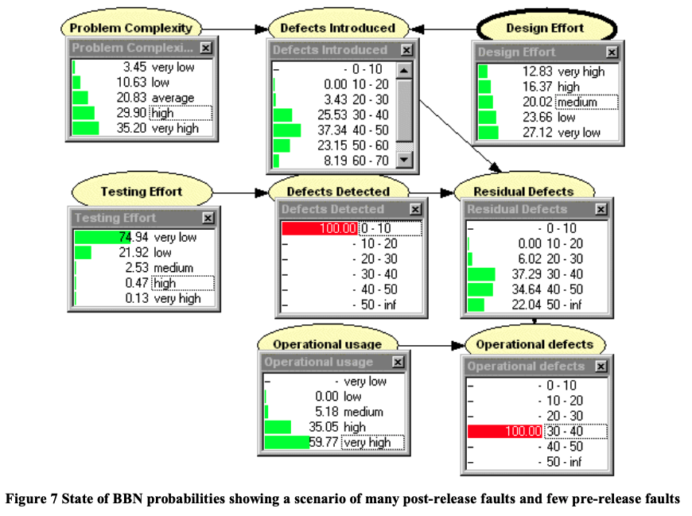


## Test-drive development


- Write tests first (which will instantly fail, since there is no code yet)
- Then, write code to fix the  failing tests
- At the end of each day
  - Leave something broken
  - So you can "switch in" straight away, tomorrow morning
- The TDD mantra
  - red (write failing tests)
  - green (write the code that fixes the tests)
  - refactor (sometimes, do a global clean up).
- Karac + Turhan (2018): TDD can't really be  defined or shown to be effective
  - [What Do We (Really) Know about Test-Driven Development? ](https://www.researchgate.net/profile/Itir_Karac/publication/326239274_What_Do_We_Really_Know_about_Test-Driven_Development/links/5cee7550299bf1f881494cf6/What-Do-We-Really-Know-about-Test-Driven-Development.pdf)
  - TDD has too many cogs,
  - Its effectiveness is highly influenced by the context (for example, the tasks at hand or skills of individuals),
  - Hard to say when you are/are not doing TDD
      -  TDD isn’t a dichotomy in which you either religiously write tests first every time or always test after the fact.
      -  Studies of 416 developers over more than 24,000 hours
         -  only 12 percent of the projects that claimed to use it, actually did
                    "write test first"
         - Studies of all Java projects in Github:  only 0.8 % were TDD. And in that set, no evidence for
           - no evidence for higher commit velocity or more issues reported or retired
  - Maybe TDD's "success" was just  that it happened at the same time that everyone stopped doing "C" and started using more
    interactive incremental development tools (e.g. Pyhton)


## Large Test Suites: Test Case Prioriization


Regression testing:


- Regression testing is re-running functional and non-functional tests to ensure that previously developed and tested software still performs as expected


But for very large test suites, cannot retest everything. What to do? Test selectively:


- Some input clusters relate to new functionality
  - The Elbaum heuristic from Elbaum, Rothermel, and Penix. 
    [Techniques for improving regression testing in continuous integration development environments.](http://cse.unl.edu/~elbaum/pre-prints/fse2014-prePrint.pdf)  Proceedings of the 22nd ACM SIGSOFT International Symposium on Foundations of Software Engineering. 2014.
  - retest if failed recently, last tested a while ago, or is new.
  - for very large test suites catches 50% of failures, within one hour
- For a survey of other ordering heuristics, see  Ling, Xiao, Rishabh Agrawal, and Tim Menzies. [How different is test case prioritization for open and closed source projects?.](https://arxiv.org/pdf/2008.00612)
    IEEE Transactions on Software Engineering 48.7 (2021): 2526-2540.
  - strange to say: good test case orderings are different for open source projects  and in-house projects.


## Black-box testing 
- Also known as _functional testing_
- Writing tests while ignoring the internals of the program. Tests are focused on whether inputs produce expected outputs dictated by customer requirements.
  - e.g. you are using some blac box service over the web
  - e.g. Realistically, exploring most code
- Black box testing cannot promise anything about the internal structure of code
  - only coverage of input/output space
  - and statistics on time to last test
- Assumes no internal knowledge of the code
  - e.g. throw random input the code, looking for a core dump


### Smart black box testing: Metamorphic Testing


  - use domain knowledge. **Metamorphic testing**
    - How to test with an oracle for the specifics of the domain?
    - Metamorphic relations (MRs) are _necessary properties_ of the intended functionality of the software
      - high-level statements that should be true across all inputs
      - e.g. in SQL, conjunctions do not lead to more output
        -    RESULT1= "all males"
        - RESULT2="bald males"
        - RESULT2 should not be larger than RESULT1
      - e.g. When testing a booking website, a web search for RESULT1= accommodation in Sydney, Australia, returns 1,671 results
        - RESULT2= Filter the price range or star rating and apply the search again;
        - RESULT2 should be a subset of RESULT1
      - e.g. A wonderful metamorphic testing result:  Z. Q. Zhou, T. H. Tse and M. Witheridge,
        [Metamorphic Robustness Testing: Exposing Hidden Defects in Citation Statistics and Journal Impact Factors](https://www.cs.hku.hk/data/techreps/document/TR-2019-03.pdf) in IEEE Transactions on Software Engineering, doi: 10.1109/TSE.2019.2915065.


### Smart black box testing: Diversity Sampling


  - **Diversity sampling:** each new test should be far way from the one before
    - e.g. all-pairs testing. No new test can mention any pair  x=v1 and y=v2 seen in prior tests.
     - so if ever you use _happy=true_ and _restDay=sunday_ then you can never test that pair again
    - so five inputs, 3 binary, one for "days of week" and one for something with ten values
      the all-pairs generation ipo.lisp](https://github.com/txt/se21/blob/61576862fed7549cd174fc392dc4441944cda910/docs/ipo.lisp)
      produces the following ("0" means "don't care")
    - note that is 68 tests, not  2\*2\*\7\*10 = 570 tests (and for larger input spaces, all-pairs offers even more 
       [dramatic reductions](https://github.com/jaccz/pairwise/blob/main/efficiency.md)).


```lisp
(ipo '(2 2 2 7 10)) ; ==>
((2 2 1 1 1) ; e.g. (true true true and first value of rest)
 (2 1 2 2 2) (1 2 2 3 3) (1 1 1 4 4)
 (2 2 2 7 5) (2 2 2 6 6) (2 2 2 5 7)
 (2 2 2 4 8) (1 1 2 1 9) (1 1 1 7 10)
 (1 1 1 6 5) (1 1 1 5 6) (2 1 1 3 3)
 (1 2 1 2 2) (2 2 1 7 9) (1 1 1 7 8)
 (1 1 1 7 7) (0 0 0 7 6)  ; note "0" means "don't care"
 (2 2 2 7 4) (0 0 0 7 3) (0 0 0 7 2)
 (1 1 2 7 1) (2 2 2 6 10) (0 0 0 6 9)
 (0 0 0 6 8) (0 0 0 6 7) (0 0 0 6 4)
 (0 0 0 6 3) (0 0 0 6 2) (0 0 0 6 1)
 (0 0 0 5 10) (0 0 0 5 9) (0 0 0 5 8)
 (0 0 0 5 5) (0 0 0 5 4) (0 0 0 5 3)
 (0 0 0 5 2) (0 0 0 5 1) (0 0 0 4 10)
 (0 0 0 4 9) (0 0 0 4 7) (0 0 0 4 6)
 (0 0 0 4 5) (0 0 0 4 3) (0 0 0 4 2)
 (0 0 0 4 1) (0 0 0 3 10) (0 0 0 3 9)
 (0 0 0 3 8) (0 0 0 3 7) (0 0 0 3 6)
 (0 0 0 3 5) (0 0 0 3 4) (0 0 0 3 2)
 (0 0 0 3 1) (0 0 0 2 10) (0 0 0 2 9)
 (0 0 0 2 8) (0 0 0 2 7) (0 0 0 2 6)
 (0 0 0 2 5) (0 0 0 2 4) (0 0 0 2 3)
 (0 0 0 2 1) (0 0 0 1 10) (0 0 0 1 8)
 (0 0 0 1 7) (0 0 0 1 6) (0 0 0 1 5)
 (0 0 0 1 4) (0 0 0 1 3) (0 0 0 1 2))
```


### Smart black box testing: Fault Localization


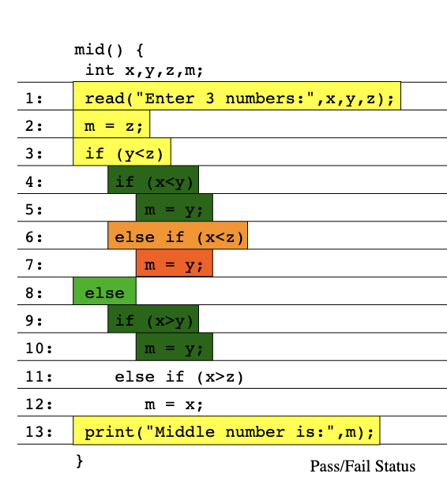


- cluster the input space and only sample the "important" parts
- but what does "importance" mean?
  - domain experts tells us that "A" never happens, but "B and D" happen a lot
  - some input clusters are more associated with errors that others (so here we are localizing inputs that might lead to failures)
    - run tests down the parse tree of a program
    - on each node, keep counters of passes and fails 
    - somehow aggregate those counters into a visualization


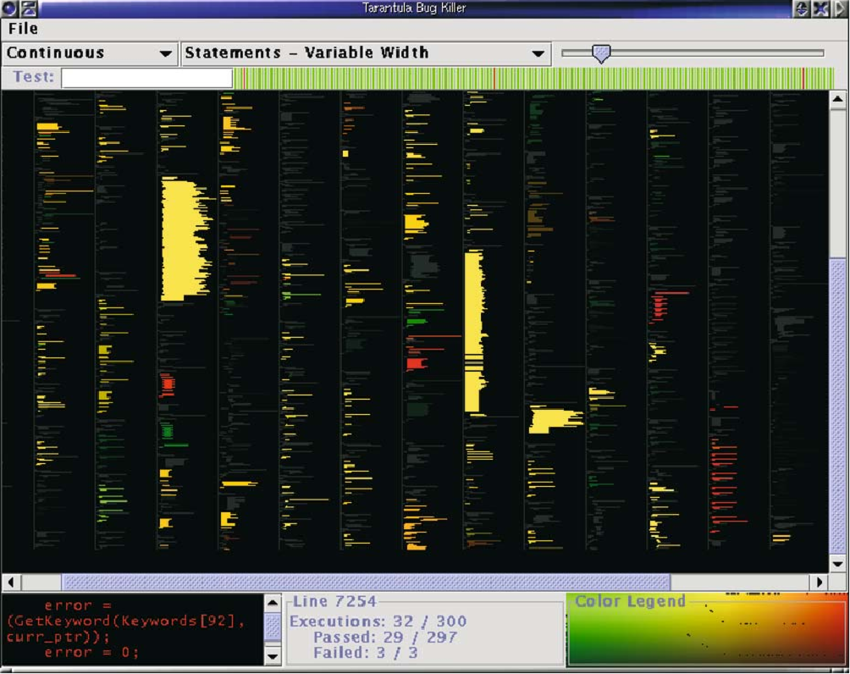


For more on test failure localization, , see Jones JA, Harrold MJ, Stasko J. Visualization of test information to assist fault localization. Proceedings of the 24th International Conference on Software Engineering. ACM, Orlando, Florida, 2002; 467–477.


- the branch weighting heuristics proposed by Jones et al. have been (exteslively)
  explored by others. For a small sample of that work, see Sarhan, Qusay Idrees, and Árpád Beszédes. "A survey of challenges in spectrum-based software fault localization." IEEE Access 10 (2022): 10618-10639.
- for a review of other fault localization heuristics, see Zakari, Abubakar, et al. "Multiple fault localization of software programs: A systematic literature review." Information and Software Technology 124 (2020): 106312.


### Smart black box testing: Doodling


  - doodle a model (at which point your "black-box" becomes kind of a guess at "white-box" reasoning, see below)
    - Read the doc
    - Doodle a model showing expectations
    - Generate tests over that doodle 
      - Run you finger over the lines and say "what do i expect to see here" <br> 
      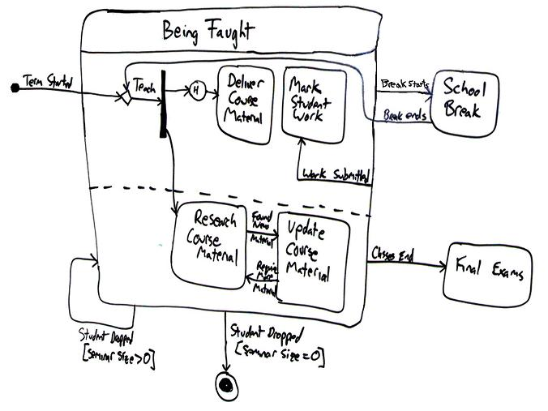


### Smart black box testing: Fuzzing


  - a structured approach to "throw stuff at random" at the program.
  - Barton Miller, University of Wisconsin in 1988.  Throw random cr\*p at a program till it crashed (brute force mutation)
    - when he was logged to a modem during a storm, there was a lot of line noise generating junk characters and those characters caused programs to crash
  - 1981: Duran and Ntafos investigated the effectiveness of testing a program with random inputs.
    - Random proves are a cost-effective alternative to more systematic testing
  - 1983: Steve Capps developed "The Monkey", a tool that would generate random inputs for classic Mac OS applications, such as MacPaint.
  - 2025 (Gerlacha, Joseph, Mathew, Menzies) for low-dimensional problems (less than 6 inputs), 50 random inputs works just as well as much more
    complex schemes.
  - Smart fuzzing #1: grammar-based fuzzing:
    - Express input as a grammar
    - Generate from tree
      - Generational fuzzing


```python
US_PHONE_GRAMMAR = {
     "<start>": ["<phone-number>"],
     "<phone-number>": ["(<area>)<exchange>-<line>"],
     "<area>": ["<lead-digit><digit><digit>"],
     "<exchange>": ["<lead-digit><digit><digit>"],
     "<line>": ["<digit><digit><digit><digit>"],
     "<lead-digit>": ["2", "3", "4", "5", "6", "7", "8", "9"],
     "<digit>": ["0", "1", "2", "3", "4", "5", "6", "7", "8", "9"]
}


[simple_grammar_fuzzer(US_PHONE_GRAMMAR) for i in range(5)]
['(692)449-5179',
 '(519)230-7422',
 '(613)761-0853',
 '(979)881-3858',
 '(810)914-5475']
```
  - Smart fuzzing #2: mutation:
    - Take a known valid input
    - Mutate it


```python
def mutate(s):
    """Return s with a random mutation applied"""
    mutators = [
        delete_random_character,
        insert_random_character,
        flip_random_character
    ]
    mutator = random.choice(mutators)
    # print(mutator)
    return mutator(s)


for i in range(10):
    print(repr(mutate("A quick brown fox")))


'A qzuick brown fox'
' quick brown fox'
'A quick Brown fox'
'A qMuick brown fox'
'A qu_ick brown fox'
'A quick bXrown fox'
'A quick brown fx'
'A quick!brown fox'
'A! quick brown fox'
'A quick brownfox'
```


  - Smart fuzzing #3: coverage:
     - Track parts of the grammar seen so far
     - Fuzz to some new place (fuzzing meets diversity sampling)


  - Smart fuzzing #4: mining examples to weight crammers:
    - Take a library of good examples
    - Weight sub-trees on (e.g.) Probability of not being "good"
    - Stochastic recursive descent:
      - Stochastically select sub-trees according to their weights
        - If weight = random then generational fuzzing
        - If select to prefer min weights, then coverage fuzzing
      - Recurs into sub tree.


##  Whitebox Testing


White box: we can open up the code and look inside:


- Coverage criteria (for code)
  - Functions (all functions called once);
    - A very weak test
  - Statement coverage
    - Supported by many tools
  - du coverage:
    - find all paths between where a variable is _defined_ and _used_.
  - Branch coverage:
    - has every condition in the program be explored;
- Warning: you can succeed on all the above, and the code still crashes.


Symbolic execution:
- Find the abstract syntax tree of the code
  - e.g. python3's `ctree` package


```python
import ctree


def f(a):
    for x in range(10):
        a[x] += x


tree1 = ctree.get_ast(f)
ctree.ipython_show_ast(tree1)
```


Applications of symbolic execution:


- Walk the tree to collect the constraints to build the tests.
- Can lead to spectacular reductions to black box testing
- e.g. BigTest: White-Box Testing of Big Data Analytics [ESEC/FSE 2019]
  - Scripts processing gigabytes of  data sets
  - Is this a hard testing problem?
    - Q: Do the tests have to handle all the possible combinations in the data?
    - A: No: they only need to cover all the branches of the code


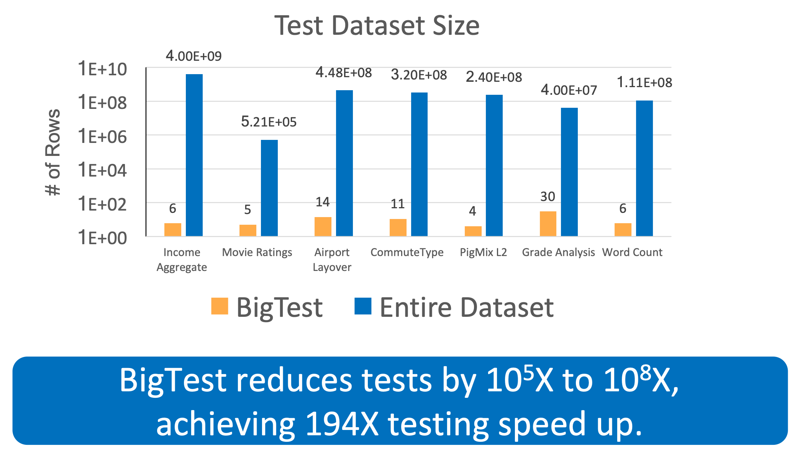


## Formal methods


Express English requirements as check-able logic, then use logic to reason about it


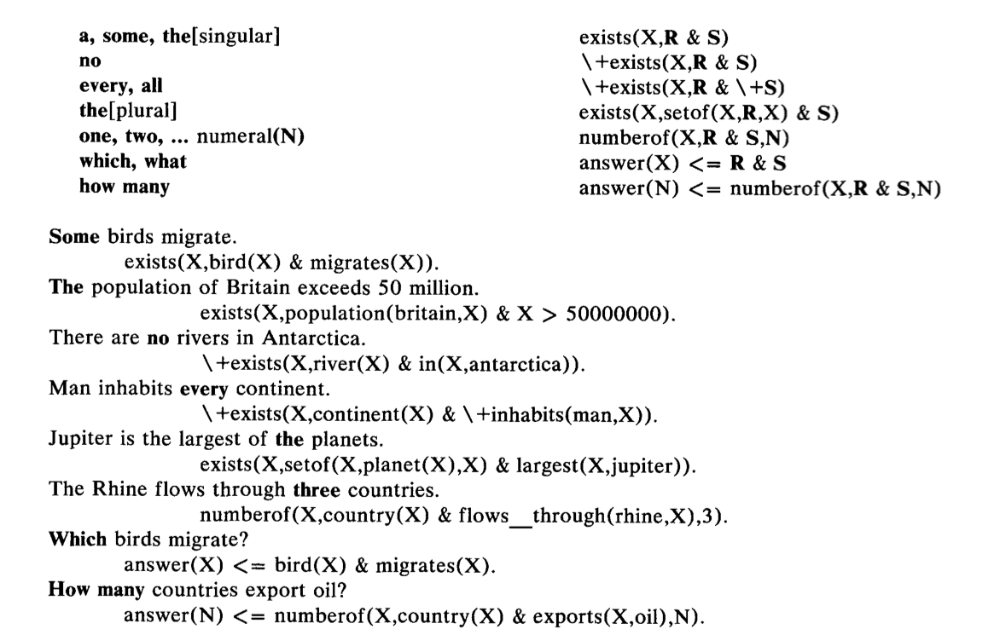


Other examples:


- Product lines:


- [Truth-Functional Propositional Logic](https://www.cs.miami.edu/home/geoff/Courses/TPTPSYS/Practicum/EnglishToLogic.shtml)


- Temporal logic (add operators for until ("U") and always "[]" eventually "<>"
   - always &#8704;, there exists at least one &#8707;


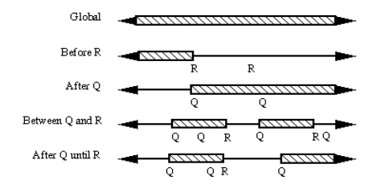


- e.g. elevator door stays open between X and Y


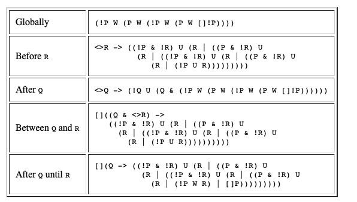


(From [One-Click Formal Methods](http://www0.cs.ucl.ac.uk/staff/b.cook/oneclick.pdf):


- FORMAL METHODS: mathematically based approaches for specifying, building,
  and reasoning about software.
- Despite 50 years of research and development, formal methods have had
  only limited impact in industry.
- Some in such domains as microprocessor design and aerospace.


Why not widely used?


- _The modeling cost_:
  Analysts must create a systems model (what is the system)
  and a properties model (what is meant to do). Properties model
  usually much smaller than systems model.
- _The execution cost_: Rigorous analysis of formal properties needs a  full search of  systems model.
- _The personnel cost:_ Analysts skilled in formal methods must be recruited or trained.
  Such analysts are generally hard to find and retain.
- _The development brake:_ The above costs can be so high that the requirements must be
   frozen for some time while we perform the formal analysis.
   Hence, one of the costs of formal analysis is that it can slow the process of requirements evolution.


Recent experience at Amazon:


- More and more, web-based systems are configured in sufficient detail
  - Such that processes can be bounced around from node to node on the cloud (to make best use of spare resources)
  - Application program interfaces (APIs) of cloud services are computer-readable contracts that establish and govern how the system behaves.
    - Most importantly, since those models are utilized by a large user community,
      - now economically feasible to build the tools needed to verify them
  - Which means that we have enough information to auto-configure our formal methods
    - and the size of the potential user community and the business value now justifies the cost of formal methods.


## "Testing" and Product Lines and Formal Methods


A feature model is a "product line"; i.e. a description of a space
of products.


Question: what are the _different_ products we can pull from the following?


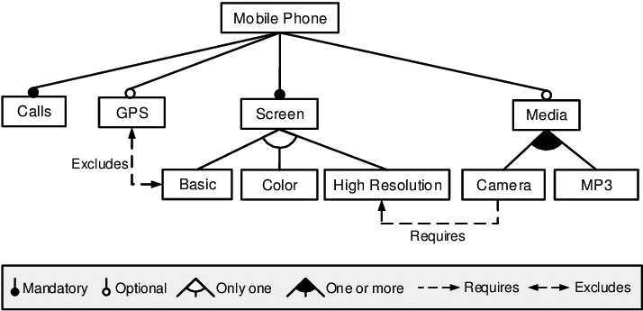


Now that was a small feature model. Suppose we are talking about something
really big like a formal model of the LINUX kernel with 4000 variables
and 300,000 contrast. Q: How to reason over that space? A: use a theorem prover.
e.g. _Pycosat_.


The following example comes from the excellent documentation
at the
[Python Picostat Github page](https://github.com/ContinuumIO/pycosat/blob/master/README.rst)


Let us consider the following clauses, represented using
the DIMACS `cnf <http://en.wikipedia.org/wiki/Conjunctive_normal_form>`_
format::


        p cnf 5 3
        1 -5 4 0
        -1 5 3 4 0
        -3 -4 0


Here, we have 5 variables and 3 clauses, the first clause being


_x1  or not x5 or x4_


Note that the variable x2` is not used in any of the clauses,
which means that for each solution with x2 = True, we must
also have a solution with x2 = False.  In Python, each clause is
most conveniently represented as a list of integers.  Naturally, it makes
sense to represent each solution also as a list of integers, where the sign
corresponds to the Boolean value (+ for True and - for False) and the
absolute value corresponds to i-th variable::


        >>> import pycosat
        >>> cnf = [[1, -5, 4], [-1, 5, 3, 4], [-3, -4]]
        >>> pycosat.solve(cnf)
        [1, -2, -3, -4, 5]


This solution translates to: x1=x5=True,
x2=x3=x4=False


To find all solutions, use `itersolve`::


        >>> for sol in pycosat.itersolve(cnf):
        ...     print sol
        ...
        [1, -2, -3, -4, 5]
        [1, -2, -3, 4, -5]
        [1, -2, -3, 4, 5]
        ...
        >>> len(list(pycosat.itersolve(cnf)))
        18


In this example, there are a total of 18 possible solutions, which had to
be an even number because x2 was left unspecified in the clauses.


The fact that `itersolve` returns an iterator, makes it very elegant
and efficient for many types of operations.  For example, using
the `itertools` module from the standard library, here is how one
would construct a list of (up to) 3 solutions::


        >>> import itertools
        >>> list(itertools.islice(pycosat.itersolve(cnf), 3))
        [[1, -2, -3, -4, 5],
         [1, -2, -3, 4, -5],
         [1, -2, -3, 4, 5]]


### Example


Feature Models and Product Lines: [Software installation as a formal methods problem](http://cseweb.ucsd.edu/~lerner/papers/opium.pdf)


Lets represent software dependencies in a logical framework:


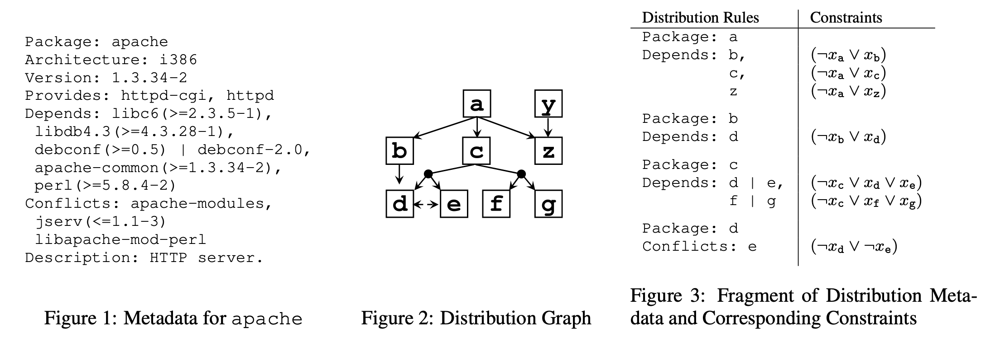


If we run Picosat over these formulae then:


- Any solution that satisfies all the constraints...
- Is a different way to create a valid install of the program.


Variants:


- min install:
   - add a cost to the install effort of each part
   - score everything coming out of `itersolve` (sum that cost)
   - pick the easiest thing to install
- optimizing:
   - generate one solution, ask some human what they think
   - if they don't like, negate it add it to the theorems
   - so future solutions will _not_ contain the thing you don;t like


**Important note:** in practice, except for trivally small
problems, no one writes DIMACS manually.


- Instead, we write code to generate DIMACS via some code.
- For example:
  [running code](https://github.com/ContinuumIO/pycosat/blob/master/examples/opium.py).


iSure! Here are 10 review questions based on the material in your document, designed to cover a mix of conceptual understanding and practical application:


## 🔍 **Review Questions**


1. What is the difference between *verification* and *validation* in the context of the V-Diagram?


2. Explain the core steps of Test-Driven Development (TDD) and summarize one reason why its effectiveness is debated.


3. List and briefly describe three types of non-functional requirements that can be difficult to test.


4. Why might a program with many faults never fail in practice, according to reliability engineering insights?


5. How does metamorphic testing help address the oracle problem in black-box testing?


6. What is the purpose of diversity sampling in test generation, and how does all-pairs testing achieve this?


7. Contrast black-box testing with white-box testing by listing at least two key differences.


8. Describe how symbolic execution can improve the efficiency of white-box testing.


9. What are some challenges associated with adopting formal methods in industry, and how has Amazon addressed some of them?


10. In feature modeling for product lines, what role do theorem provers like Pycosat play, and how can they be used to optimize software installations?


